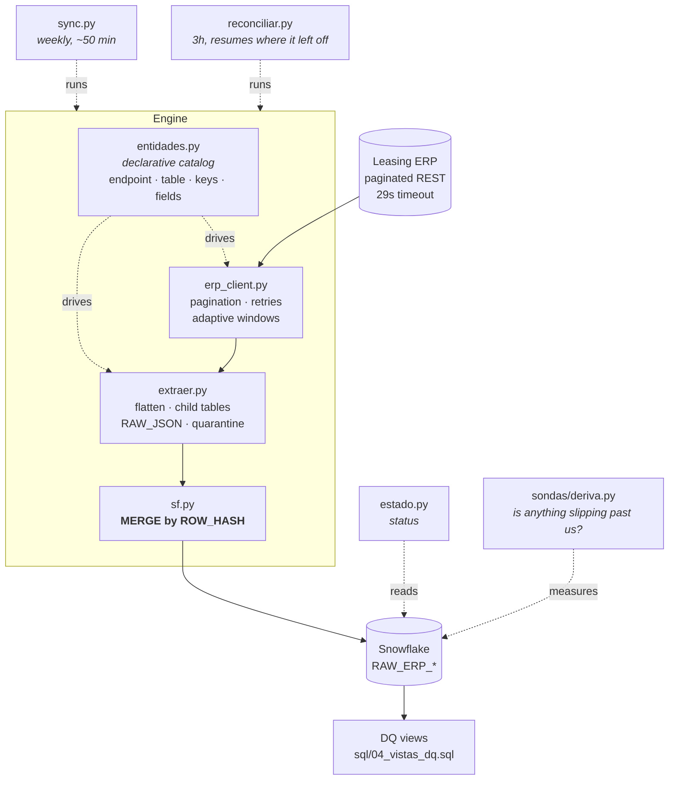

# ERP → Snowflake ELT

> An incremental pipeline that mirrors a leasing ERP into Snowflake: 24 entities,
> one declarative catalog, and a merge that writes only what actually changed.
> Built at a real estate and media group in Mexico.
> **Anonymized portfolio version — all data is synthetic.**

 

---

## The problem

The group's leasing operation lived inside a vendor ERP reachable only through a
paginated REST API with a 29-second timeout. Finance, compliance and operations all
needed that data in the warehouse, and none of them could get at it.

Two things made a naive nightly dump impossible:

- **Volume.** A full historical pull takes ~120 hours. It cannot run every night.
- **The source lies about change.** Most entities expose a `modifiedDate`, but the
  ERP re-stamps it in bulk — measured: 4,676 of 4,970 contracts carrying the same
  timestamp. Three entities expose no modification date at all.

So "pull what changed since yesterday" is not a question the source can answer honestly.

## What I built

A pipeline that decides what changed **by content**, not by the source's word. Every
row carries a `ROW_HASH`; the merge compares fingerprints and touches only the rows
whose fingerprint moved. A second, slower pass re-reads history in slices and
compares hashes to catch what the incremental pass structurally cannot see.

| | |
|---|---|
| **Stack** | Python 3.11 · Snowflake · pandas · `write_pandas` |
| **Scale** | ~24 entities · 50 companies · millions of rows · full load ≈ 120 h |
| **Weekly run** | ~50 min, window auto-extends from the last successful run |
| **Outcome** | Warehouse stays current with no duplicates and no blind spots |

---

## Architecture



---

## Design decisions

### The fingerprint excludes the dates

`ROW_HASH` is an MD5 of the business content with `createdDate` and `modifiedDate`
removed. Including them would mean the nightly bulk re-stamp rewrites the entire table
every morning — thousands of spurious `UPDATE`s, and idempotency gone.

This is the decision the whole pipeline rests on, and `scripts/run_demo.py` proves it:
pass 3 re-stamps every date and writes zero rows.

### One catalog, not 24 scripts

`src/entidades.py` is a single dictionary describing every entity: endpoint, target
table, merge keys, page size, field map, which columns are numeric or dates, whether
the entity needs iterating per company, and which field carries the delta. The engine
reads it. **Adding an entity is adding a dictionary entry** — no new script, no new
branch in the loop.

The demo generator reads the same catalog to produce its fake records, which is a
small proof that the catalog really is the single source of truth.

### A reconciler, because the incremental pass is not enough

Three entities — bank movements, expenses, expense payments — expose no modification
date. For those, "what changed since last time" is unanswerable from the API. Rather
than pretend otherwise, there is a second pass that walks historical slices, re-reads
them and compares fingerprints. It resumes where the previous run stopped and covers
the full history in about a month, then starts over.

Being explicit about what the fast path *cannot* see is the point. A pipeline that
silently misses updates is worse than one that admits it needs a second pass.

### Nothing is dropped, ever

Every row stores the complete original JSON in a `RAW_JSON` VARIANT column, so a field
nobody mapped today is still recoverable tomorrow. Records arriving without a primary
key are not discarded — they go to a quarantine table.

One case forced an exception: an invoice with ~9,000 nested line items exceeded
Snowflake's 16 MB limit for a single value, and two jobs died on it. The fix prunes the
child arrays out of the parent's `RAW_JSON` and records how many were removed and
where they live — because those children are already stored, complete and one per row,
in their own table. Losing the whole invoice would have been the real data loss.

### VARIANT columns need a staged workaround

`write_pandas` cannot write a VARIANT from a pandas string — it would store the JSON as
a *string inside* the VARIANT, and `RAW_JSON:field` would return NULL. The stage table
is created `LIKE` the target, its VARIANT columns are switched to VARCHAR, and the
merge wraps them in `PARSE_JSON()`. The VARIANT columns are detected automatically from
`INFORMATION_SCHEMA`, so nobody has to remember.

### Three double-clickable files

The people who depend on this pipeline are not engineers. The operational surface is
three `.bat` files — update, reconcile, status — and everything else is internals.
Logs go to a fixed path that can be pasted into Explorer.

---

## Run it locally

No credentials, no Snowflake, no network. The demo swaps the two boundaries — the API
client and the warehouse — for local doubles and runs the real engine between them.

```bash
git clone https://github.com/chino-bot1701/erp-snowflake-elt.git
cd erp-snowflake-elt
python scripts/run_demo.py
```

Four passes, each one asserting something:

```
PASS 1 — first load                          926 insert,   0 update
PASS 2 — identical source, run again           0 insert,   0 update   <- idempotent
PASS 3 — source re-stamps every modifiedDate   0 insert,   0 update   <- hash ignores dates
PASS 4 — 5% of records genuinely edited        0 insert,  47 update   <- only those rows

  [PASS]  re-running identical data wrote 0 rows
  [PASS]  bulk re-stamped dates wrote 0 rows
  [PASS]  contrato: 15 rows updated, expected 15; 0 inserted, expected 0
```

Exit code is non-zero if any assertion fails, so it works as a smoke test.

Inspect the result:

```bash
sqlite3 out/demo.sqlite "SELECT ID_CONTRATO, ESTATUS, ROW_HASH FROM RAW_ERP_CONTRATO LIMIT 5"
```

### Against a real warehouse

```bash
cp .env.example .env     # fill in, then export the variables
pip install -r requirements.txt
python src/sync.py --help
```

---

## What the demo reuses, and what it replaces

| Component | In the demo |
|---|---|
| `src/entidades.py` — the catalog | **real, unchanged** |
| `src/sf.py` — `row_hash()` | **real, unchanged** |
| `src/extraer.py` — `construir_fila()` | **real, unchanged** |
| `src/erp_client.py` — HTTP, pagination, retries | replaced by `demo/fake_api.py` |
| `src/sf.py` — `merge_upsert()`, Snowflake `MERGE` SQL | replaced by `demo/warehouse.py`, same decision rule on SQLite |

The Snowflake merge cannot run on SQLite, so the demo reimplements the *rule*
(absent → insert, same hash → skip, different hash → update) and leaves the production
SQL visible in `src/sf.py`.

---

## Repository layout

```
src/entidades.py        the declarative catalog — start here
src/sf.py               Snowflake connection + MERGE by ROW_HASH
src/erp_client.py       API client: pagination, retries, adaptive windows
src/extraer.py          flattening, child tables, RAW_JSON, quarantine
src/sync.py             weekly incremental run
src/reconciliar.py      fingerprint reconciliation over history
src/backfill.py         windowed historical load
src/verificar.py        counts against the API, re-queues gaps
src/estado.py           status report
src/memoria.py          RAM guard for large windows
sql/                    DDL, staging views, data-quality views, sync control
sondas/                 read-only drift measurement
bin/                    the three operator entry points
demo/                   fake API + SQLite warehouse
scripts/run_demo.py     the four-pass demo
```

---

## Notes on anonymization

This is a real production pipeline, rewritten for public release:

- The ERP vendor, the group, its companies and the warehouse topology are **renamed**.
- Credentials and endpoints are read from environment variables; see `.env.example`.
  Nothing is committed.
- All demo data is generated by `demo/fake_api.py` from a fixed seed.
- Internal notes, dates and decisions that referenced the employer were removed.

The architecture, the measurements quoted above and the engineering decisions are real.
